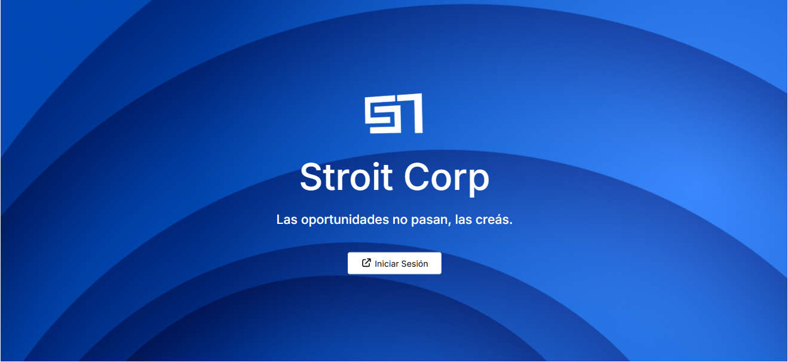

Sistema web para STROIT CORP S.A., empresa ecuatoriana de visados, que automatiza la gestión de contratos, clientes y ventas, resolviendo problemas de operatividad manual y escalabilidad. Incluye módulos de usuarios, métricas y pagos, alineando la empresa con estándares tecnológicos globales.

## 📂 Recursos

### Documentos
- [📄 Tesis completa ](/docs/Tesis_Final_José-Galarza.pdf)  
- [📊 Fomulario  F_AA_233 ](/docs/F_AA_233.pdf)  

### Videos
- [▶️ Tutorial de funcionamiento del proyecto](https://youtu.be/Hl3LaZUSHtc)

### Producción 
▲ [Deployed on Vercel](https://contratos-tesis.vercel.app/) 
